# ab_alive_monitoring_app
Webページ死活監視アプリ

# 目次
### 1.[概要](#anchor1)
### 2.[システム構成](#anchor2)
### 3.[機能一覧](#anchor3)
### 4.[使用方法](#anchor4)


<a id="anchor1"></a><br>    

## 1. 概要
---
 Webページ死活監視アプリ(以下、死活監視アプリ)は、Webページの死活監視を行うPython3アプリケーションである。


<a id="anchor2"></a><br>    

## 2. システム構成
---
 本アプリが動作するシステム構成図を以下に示す。


| No. | 名称                    | 説明                                                                                                              |
| --- | ----------------------- | ----------------------------------------------------------------------------------------------------------------- |
| 1   | Webページ死活監視アプリ | 本アプリ<br> Python3にて開発                                                                                      |
| 2   | Webページ               | 死活監視対象となるWebページ                                                                                       |
| 3   | Linuxサーバ             | 死活監視アプリを動作させるLinux環境<br> Google Cloud PlatformのCoumnpute Engineサービスを使用<br>Ubuntu 20.04 LTS |
| 4   | メール受信端末          | 死活監視アプリからの通知メール受信に使用                                                                          |
| 5   | 管理者                  | 死活監視アプリからの通知メールを確認し、必要に応じて管理者はWebページサーバの再起動等を実施する                   |

<a id="anchor3"></a><br>    

## 3. 機能一覧
---
以下に死活監視アプリの機能一覧を示す。

| No. | 機能名               | 説明                                                        |
| --- | -------------------- | ----------------------------------------------------------- |
| 1   | Webページ死活監視    | 監視対象のWebページに対し、一定時間ごとに死活監視を行う機能 |
| 2   | 通知メール送信       | 管理者確認用の通知メールを作成し自動送信する機能            |
| 3   | 設定ファイル読み出し | アプリ起動時に設定ファイルから各種パラメータを読み出す機能  |
<br>

### 3.1. Webページ死活監視  
「Webページ死活監視」は、監視対象のWebページに対して一定時間ごとに「死活監視通信」を行い、その応答を確認する機能である。「死活監視通信」は、死活監視アプリの起動直後に1回、以降10分に1回の頻度で実施する。「死活監視通信」の手順を以下に示す。

 * 「死活監視通信」を開始すると、死活監視アプリは監視対象のWebページに対し、最小1秒間隔で最大3回通信を施行する。通信はHTTPのGETリクエストとする。
 * 3回の通信のうち、1回でもHTTPレスポンスステータスコードの200番台(成功レスポンス)を受信できれば、正常と判定し、「死活監視通信」を終了する。3回全ての通信において前述以外のHTTPレスポンスステータスコードを受信した場合は、異常と判定し、「死活監視通信」を終了する。
    
監視対象のWebページのURLは、後述の「設定ファイル読み出し」機能にて取得する。
<br>

### 3.2. 通知メール送信
「通知メール送信」は、「メール送信イベント」発生に応じて、メールを作成し、指定されたメールアドレス宛に送信する機能である。送信先
メールアドレスは、後述の「設定ファイル読み出し」機能にて取得する。  
「メール送信イベント」を以下に示す。  
    **※No.2, No.3の機能は、現状未設計である**

| No.   | イベント名        | 説明                                                  |
| ----- | ----------------- | ----------------------------------------------------- |
| 1     | Webページ異常応答 | 「Webページ死活監視」機能にて異常判定がされた時に発生 |
| ~~2~~ | ~~定時連絡~~      | ~~死活監視アプリにて自発的、定期的に発生~~            |
| ~~3~~ | ~~アプリ起動~~    | ~~死活監視アプリの起動時に発生~~                      |

#### 3.2.1. Webページ異常応答
「Webページ異常応答」は、「Webページ死活監視」機能にて異常判定がされた時に発生するイベントである。本イベント発生時に送信するメールのフォーマットを以下に示す。 

    TBD
### 3.3. 設定ファイル読み出し (※現状未実装)
「設定ファイル読み出し」は、死活監視アプリ起動時に各種パラメータを設定ファイルから読み出す機能である。設定ファイル名は`alive_mon.json`とし、死活監視アプリと同じディレクトリに配置する。設定ファイルから読み出すパラメータ一覧を以下に示す。

| No. | キー名          | 説明                                                                       |
| --- | --------------- | -------------------------------------------------------------------------- |
| 1   | target_urls     | 「Webページ死活監視」機能にて監視対象とするURL<br>配列による複数指定可     |
| 2   | send_mail_addrs | 「通知メール送信」機能にて通知メールを送信する宛先<br>配列による複数指定可 |

<a id="anchor4"></a><br>    

## 4. 使用方法
---
死活監視アプリ(コマンド名:`alive_mon.py`)の使用方法を以下に示す。(オプション引数なし)
```shell
./alive_mon.py
```
※事前にアプリと同じディレクトリに設定ファイル`alive_mon.json`を設置しておくこと