# ab_alive_monitoring_app 結合評価項目表

# 目次
### 1.[評価環境](#anchor1)
### 2.[試験項目](#anchor2)

 

## 1. 評価環境
評価環境を以下に示す

| No. | 名称                    | 説明                                                                                                                                                                                                                                                               |
| --- | ----------------------- | ------------------------------------------------------------------------------------------------------------------------------------------------------------------------------------------------------------------------------------------------------------------ |
| 1   | Webページ死活監視アプリ | 試験対象アプリ node.jsにて動作                                                                                                                                                                                                                                  |
| 2   | Linuxサーバ             | Webページ死活監視アプリを動作させるLinux環境  Google Cloud PlatformのCoumnpute Engineサービスを使用 Ubuntu 20.04 LTS                                                                                                                                         |
| 3   | 評価用PC                | 評価に用いるPC。以下の機能を持つ ・死活監視対象となる評価用サーバ(node.jsアプリ)が動作する ・SSH接続にて、Linuxサーバのコンソールに接続し、Webページ死活監視アプリが出力するログなどを確認する  Webページ死活監視アプリから送信される通知メールを受信する |
| 4   | 評価者                  | 評価用PCより、Webページ死活監視アプリの動作結果等を確認する                                                                                                                                                                                                        |

※メモ
LinuxサーバにあるWebページ死活監視アプリから評価用PCのサーバに接続する方法は以下の通り
1. 評価用PCのブラウザで`ifconfig.me`を開き、外部IPアドレスを確認する。
2. Webページ死活監視アプリから、以下のURL宛に死活監視を行う
   `http://{外部IPアドレス}:{ポート番号}/`

 

## 2. 試験項目

| No. | 試験内容               | 確認内容                                                                                                  | 結果 | 実施日     | 備考 |
| --- | ---------------------- | --------------------------------------------------------------------------------------------------------- | ---- | ---------- | ---- |
| 1   | (正常)                 | ・{URL} is OKと出力すること ・メールを送信しないこと ・00, 10, 20, 30, 40 ,50分毎に実行していること | OK   | 2021/07/11 |      |
| 2   | 存在しないドメイン指定 | ・エラーメッセージを出力すること ・メールを送信すること ・アプリが異常終了しないこと                | OK   | 2021/07/11 |      |
| 3   | 存在しないページ指定   | ・エラーメッセージを出力すること ・メールを送信すること ・アプリが異常終了しないこと                | OK   | 2021/07/11 |      |
| 4   | タイムアウト           | ・エラーメッセージを出力すること ・メールを送信すること ・アプリが異常終了しないこと                | OK   | 2021/07/11 |      |
| 5   | 500エラー              | ・エラーメッセージを出力すること ・メールを送信すること ・アプリが異常終了しないこと                | OK   | 2021/07/11 |      |